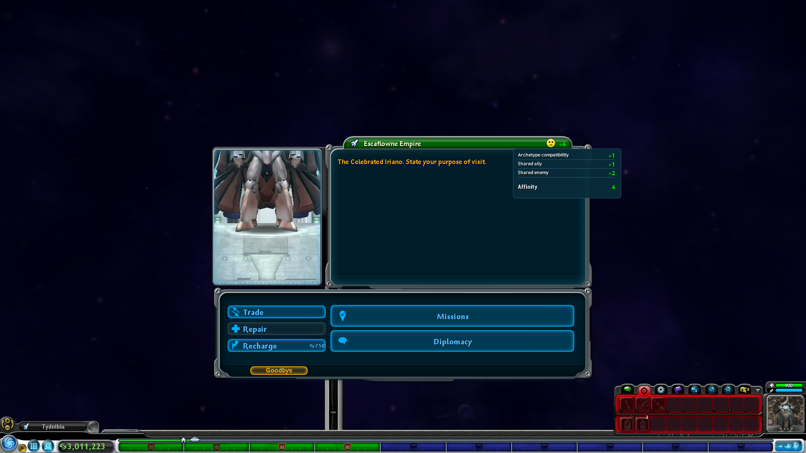
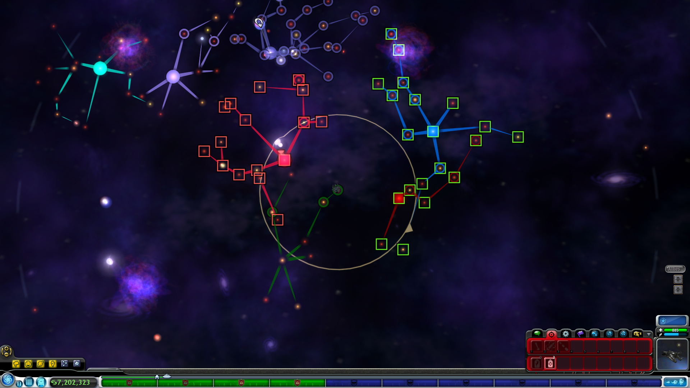
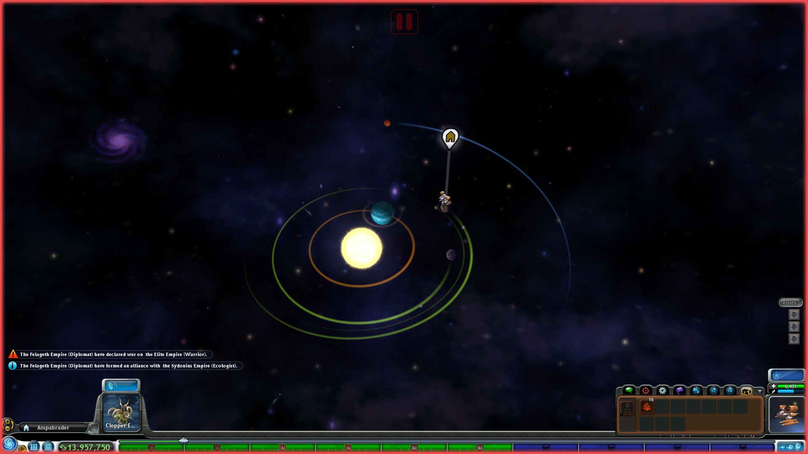
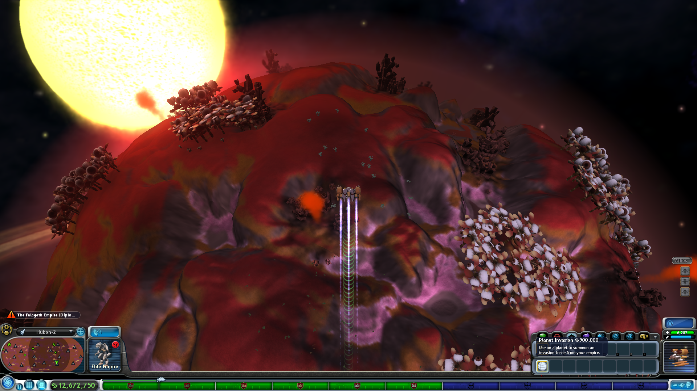
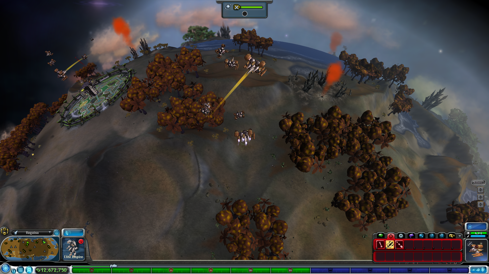

# Space Diplomacy and Warfare Overhaul

## Overview
This mod completely overhauls the original AI logic for diplomacy and warfare during the space stage. Empires no longer act randomly, instead make decisions based on their archetype, both when forming alliances and declaring wars. And, during wars, the AI now produces ships according to its economic capacity and selects planets to attack using a fully reworked algorithm. The result is a more dynamic galaxy, where political relationships evolve coherently and conflicts generate logical and coherent battlefronts.

## Diplomacy

### Affinity System
The new diplomacy is based on affinity, primarily determined by archetype compatibility.

- Compatible archetypes generate positive affinity and improve relations.
- Incompatible archetypes produce negative affinity and increase the likelihood of war.

Affinity is also influenced by common allies, common enemies, and wars involving allies. Players can check their affinity with any empire at any time through the comm interface.

**Archetype compatibilities:**

- **Warriors:** Dislike all except other warriors.
- **Zealots:** Hate almost everyone (especially shamans and scientists) and adore other zealots.
- **Scientists:** Hate zealots and shamans, dislike ecologists and warriors, and like other scientists, traders, and bards.
- **Traders:** Hate ecologists, dislike shamans, warriors, and zealots, and like other traders, scientists, and bards.
- **Bards:** Dislike diplomats, zealots, and warriors, and like other bards, traders, and scientists.
- **Ecologists:** Hate traders, dislike scientists, warriors, and zealots, like shamans and diplomats; adore other ecologists.
- **Shamans:** Hate zealots and scientists, dislike warriors and traders, like diplomats, ecologists, and other shamans.
- **Diplomats:** Hate warriors; dislike zealots and bards, like shamans and ecologists, adore other diplomats.

The player will get a permanent negative effect, *“your presence disturbs us,”* with incompatible archetypes, or a positive one, *“we think alike,”* with compatible archetypes. 

### AI Alliances
- AI empires only form alliances with other AI empires they have positive affinity with. 
- If affinity drops to zero or becomes negative, the alliance can break.
- If two allies go to war, the AI will stay allied with the one it has higher affinity for and break the alliance with the other, even if that other is the player. 

### Player Alliances
- Affinity affects player alliances:
  - **Positive affinity:** the +100 relationship effect bonus *“We created an alliance”* is permanent.
  - **Neutral affinity:** the bonus gradually decreases until it disappears.
  - **Negative affinity:** the initial bonus becomes a penalty down to –100.
- Nearby empires with positive affinity, even if not allies, can improve their relations with the player in +25 increments up to +100.

### AI Wars
- Each archetype has an aggressiveness level:
  - **Warriors and zealots:** very aggressive.
  - **Scientists, traders, and bards:** intermediate.
  - **Ecologists, diplomats, and shamans:** peaceful.
- Aggressiveness increases with empire level, so even the most peaceful archetypes have a small chance of declaring war on neighbors with negative affinity once they reach level 5.
- The AI declares war only while at peace and only against empires with zero or negative affinity, unless the target is an ally’s enemy, in which case it automatically joins the war. 

### Player Wars
- Empires no longer request tribute from the player; if an AI empire chooses to declare war against the player, it declares war immediately. 

### Interface Changes
- The comm tab shows your affinity with the empire.
- Pressing the **“Allies and Enemies”** button highlights an empire’s allies and enemies when hovering over their star systems. 
- Notifications for:
  - Declarations of war.
  - Alliance formations.
  - Alliance breaks.

*Affinity Interface*

*Allies (green squares) and enemies (red squares) of an AI Empire*

*Diplomacy Notifications*

## Warfare

### AI Attack Logic
- The AI no longer attacks planets randomly; it now targets systems near its own and avoids “jumping over” stars. 
- Each “turn,” empires produce bombers based on the terraforming and spices of all their planets. They use those bombers to attack enemy planets, so larger and more developed empires can raid more planets.
- The number of bombers assigned to attack a planet depends on its defenses. An empire may send just a few bombers to attack a T0 planet, but deploy massive fleets to attack homeworlds or T3 planets.

### Player Attacks
- The player now has access to a new tool called **“Planet Invasion”**, allowing the player to summon a fleet from their empire to an enemy planet.
- The fleet size and cost of using the tool depend on the planet’s defenses, using the same logic as the AI.

*Planet Invasion: Tooltip*

*Planet Invasion: Summoned a Player Fleet*

### Customization and Settings
- **Active Radius:** Defines the mod’s active range relative to the player’s homeworld, only empires withing XX pc will make alliances, declare wars, attack their enemies, etc. Options range from 40 pc to 200 pc, larger values may impact performance.
- **Relationship Effects:** Rebalances relationship effects to make it harder to reach a high relationship with an empire, forcing the player to engage with the affinity system. Can be set to vanilla-like to override these changes.
- **AI Aggressiveness:** Adjusts the base probability of AI empires starting wars. Options are low, normal and high.
- **Notifications:** Adjust which notifications the player receives based on type and relationship. For alliance formations, broken alliances, and war declarations, you can choose to receive no notifications, only notifications involving allies and/or enemies, or all notifications regardless of participants. 
- **Space Combat:** Rebalances all space combat values (from player weapons to empires ships health) for smoother early-to-late game progression. No changes are made to empires of level 5, the Grox, or the highest-level weapons, changes buff lower levels to reduce power spikes. Includes an option to remove the tool Rally-Call while buffing the base damage of all player and posse weapons.  Also includes and option to leave space combat unchanged.
- **AI Bomber Production Rate:** Multiplier for AI bomber production, ranging to 15% of the base rate to four times as fast.
- **Player Bomber Cost:** Sets the cost of each bomber when using the “Planet Invasion” tool. 
- **Hostile Archetype Buffs:** increases bomber production for AI empires with archetypes incompatible with the player, making the space stage more challenging. Ranges from no buffs no extreme buff.
- **Warrior & Zealot Buffs:** Buffs AI Zealots and Warriors empires to compensate for their diplomatic isolation. Warriors receive a flat +4 to bomber production (a buff stronger in the early game) while Zealots get a x1.20 multiplier, a general buff that is stronger in the late game.
- **Sensible AI Colonization Patch:** Compatibility patch for the Sensible AI Colonization mod. Apply if the mod is installed. 

## Installation
- Requires UPE.
- Starting a new game is recommended to correctly apply affinity bonuses and penalties. No galaxy reset required.

## Known Issues
- Knights and Wanderers are not fully integrated into the affinity system, they treated as Warriors or Diplomats respectively.
- The affinity tooltip interface may overlap with other elements of the comm UI. 
- AI attack strength against the player is the same as against other empires, which can be harder than intended if you don’t have *Defensive Ships in Player Colonies* installed.
- Not balanced for Uber Turret yet.

This is a very large mod that changes many aspects of the game. For any issues or suggestions, contact me on Discord or create an issue on GitHub.
