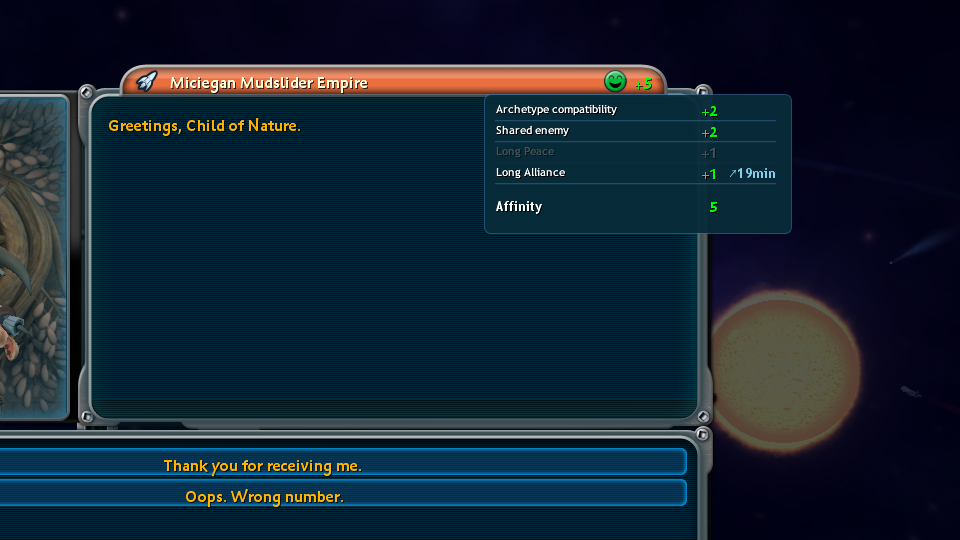
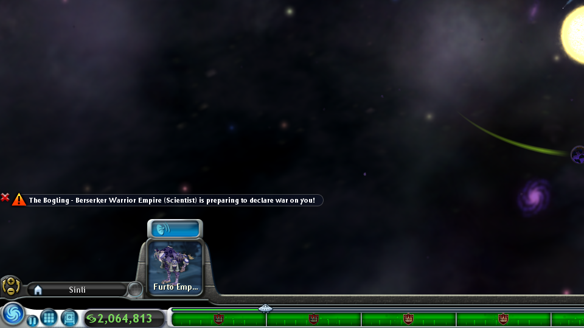
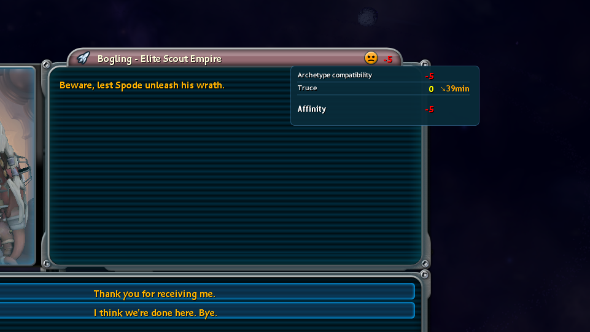
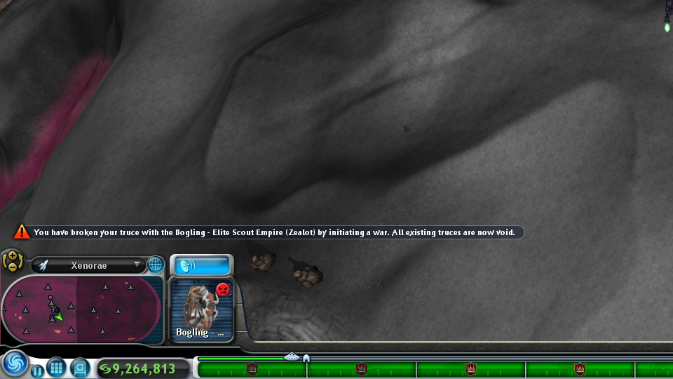
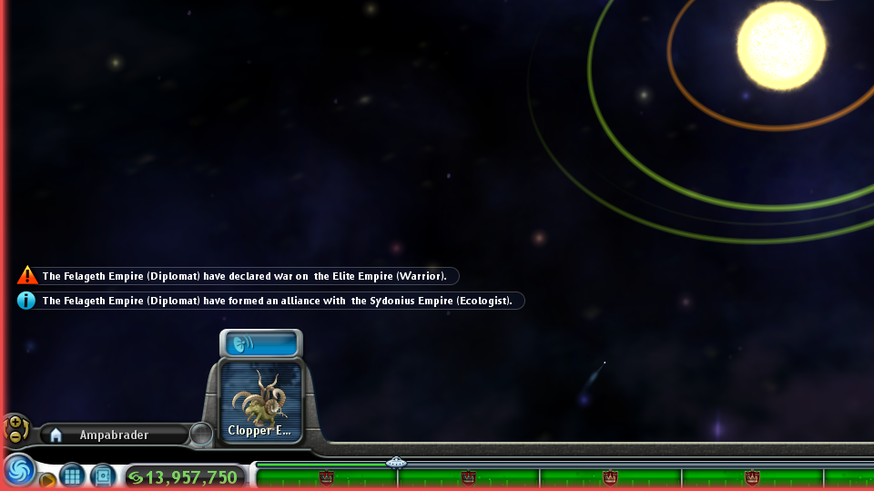
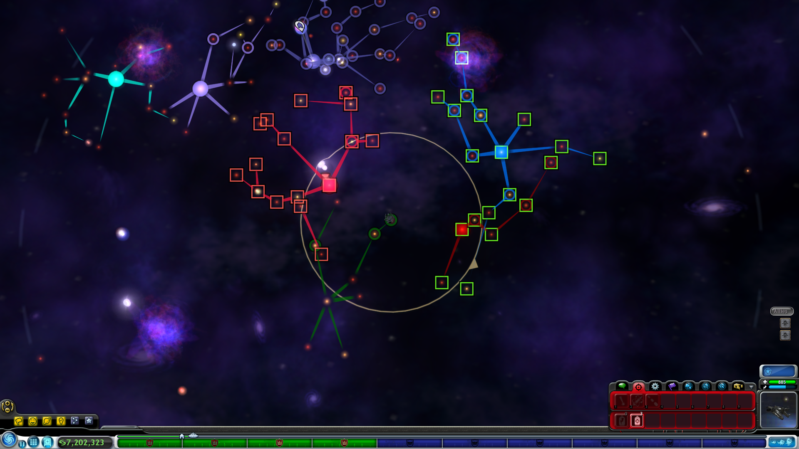
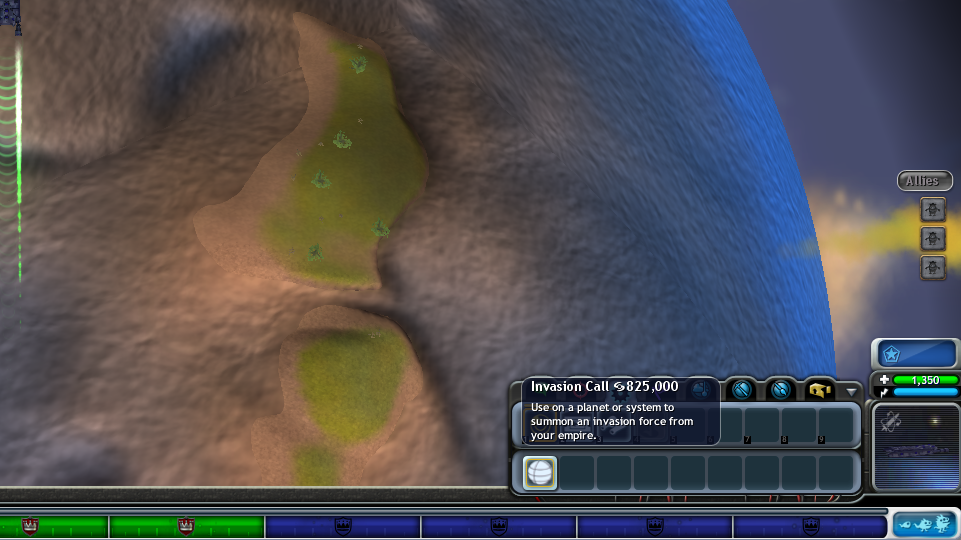
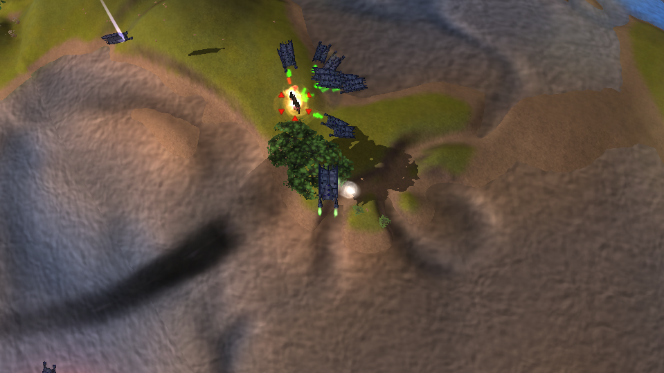

# Space Diplomacy and Warfare Overhaul

## Overview
This mod completely overhauls the original AI logic for diplomacy and warfare during the space stage. Empires no longer act randomly, instead make decisions based on their archetype, both when forming alliances and declaring wars. And, during wars, the AI now produces ships according to its economic capacity and selects planets to attack using a fully reworked algorithm. The result is a more dynamic galaxy, where political relationships evolve coherently and wars generate logical and coherent frontlines.

## Diplomacy

### Affinity System
The new diplomacy is based on affinity, primarily determined by archetype compatibility.

- Compatible archetypes generate positive affinity and improve relations.
- Incompatible archetypes produce negative affinity and increase the likelihood of war.

**Archetype compatibilities:**

- **Warriors:** Dislike all except other warriors.
- **Zealots:** Hate almost everyone (especially shamans and scientists) and adore other zealots.
- **Scientists:** Hate zealots and shamans, dislike ecologists and warriors, and like other scientists, traders, and bards.
- **Traders:** Hate ecologists, dislike shamans, warriors, and zealots, and like other traders, scientists, and bards.
- **Bards:** Dislike diplomats, zealots, and warriors, and like other bards, traders, and scientists.
- **Ecologists:** Hate traders, dislike scientists, warriors, and zealots, like shamans and diplomats; adore other ecologists.
- **Shamans:** Hate zealots and scientists, dislike warriors and traders, like diplomats, ecologists, and other shamans.
- **Diplomats:** Hate warriors; dislike zealots and bards, like shamans and ecologists, adore other diplomats.

The player will get a permanent negative effect, *“your presence disturbs us,”* with incompatible archetypes, or a positive one, *“we think alike,”* with compatible archetypes.

**Other Sources of Affinity**

In addition to archetype compatibility, affinity is also influenced by:

- Having at least one common ally adds +1 to affinity.
- Having at least one common enemy adds +2 to affinity.
- Being at war with another empire's ally subtracts -1 from affinity.
- A long-lasting peace adds +1 to affinity.
- Long-lasting alliances add up to +2 to affinity.
- Having defeated a common enemy temporarily adds +2 to affinity.
- Having uplifted an empire with a monolith adds +2 to affinity.

Affinity bonuses from long-lasting alliances and long-lasting peace do not stack with each other, and the same is true for the common enemy and defeated common enemy bonuses.

The comm tab shows your affinity with the empire.

*Affinity Interface*

The long alliance and long peace bonuses don't stack, which is why the long peace bonus appears greyed out in the image. The same happens with the common enemy and defeated common enemy bonuses.

### AI Alliances
- AI empires only form alliances with other AI empires they have positive affinity with. 
- If affinity drops to zero or becomes negative, the alliance can break.
- If two allies go to war, the AI will stay allied with the one it has higher affinity for and break the alliance with the other, even if that other is the player. 

### Player Alliances
- Affinity affects player alliances:
  - **Positive affinity:** the +100 relationship effect bonus *“We created an alliance”* is permanent.
  - **Neutral affinity or negative affinity:** the bonus gradually decreases until it disappears.
- Nearby empires with positive affinity, even if not allies, can improve their relations with the player in +25 increments up to +100.

### AI Wars
- Each archetype has an aggressiveness level:
  - **Warriors and zealots:** very aggressive.
  - **Scientists, traders, and bards:** intermediate.
  - **Ecologists, diplomats, and shamans:** peaceful.
- Aggressiveness increases with empire level, so even the most peaceful archetypes have a small chance of declaring war on neighbors with negative affinity once they reach level 5.
- AI empires can declare war through two different mechanisms: joining an ally's war, or declaring a war on their own initiative.
  - Joining an ally's war: If within range of an empire that is at war with an ally, the AI will automatically declare war on its ally's enemy, as long as it has lower affinity with the target than with the ally.
  - War on its own initiative: If neighboring an empire with an affinity of zero or lower and a relationship below 30 (worse than blue face), the AI may decide to declare war, with the probability depending on the archetype's aggressiveness. In the player's case, they receive a notification informing them that the empire is preparing to declare war, which can be avoided by raising the relationship to 30 or higher.

*An empire preparing for war against the player*

### Player Wars
- With this new system for declaring wars, AI empires will no longer demand tribute from the player.

### Truces
When the player takes an action that ends a war against an AI empire, a 40-minute truce is formed between that empire and the player. Depending on how peace was reached, the AI's allies or the player's allies may also sign truces.
- If the player accepts an AI empire's peace request, a truce is signed between the player's alliance bloc and that empire.
- If the player pays an AI empire to make peace, a truce is signed between the player's alliance bloc and the empire's alliance bloc.

The remaining truce duration can be seen in the affinity interface of the communications panel. If the player breaks the truce (by starting a war with the empire), all of the player's active truces will be cancelled.

*The truce's remaining time, as shown in the affinity interface*

*Consequences of breaking a truce*

### Notifications
The player will receive notifications for:
- War declarations
- Peace declarations
- Alliances
- Broken alliances

*Diplomacy Notifications*

### Galaxy View Changes
- Pressing the **“Allies and Enemies”** button highlights an empire’s allies and enemies when hovering over their star systems. 

*Allies (green squares) and enemies (red squares) of an AI Empire*

## Warfare

### AI Attack Logic
- The AI no longer attacks planets randomly; it now targets systems near its own and avoids “jumping over” stars. 
- Each “turn,” empires produce bombers based on the terraforming and spices of all their planets. They use those bombers to attack enemy planets, so larger and more developed empires can raid more planets.
- The number of bombers assigned to attack a planet depends on its defenses. An empire may send just a few bombers to attack a T0 planet, but deploy massive fleets to attack homeworlds or T3 planets.

### Player Attacks
- The player now has access to a new tool called **“Invasion Call”**, allowing the player to summon a fleet from their empire to an enemy system.
- The fleet size and cost of using the tool depend on the planet’s defenses, using the same logic as the AI.

*Invasion Call: Tooltip*

*Invasion Call: Summoned a Player Fleet*

### Customization and Settings
- **Active Radius:** Defines the mod’s active range relative to the *active range center* (the player's position or homeworld, depending on the next option); only empires within XX pc will make alliances, declare wars, attack their enemies, etc. Options range from 40 pc to 200 pc, larger values may impact performance.
- **Active Range Center:** Defines the center of the radius in which the mod is active. It can be the player's homeworld (for a static active range) or based on the player's current position, to "activate" other zones as the player moves through the galaxy.
- **Player Exclusion Depth:** To prevent the mod from affecting other saved games, empires belonging to other players' save files are automatically excluded from being affected by the mod. Options are also provided to additionally exclude the allies and enemies of other players' empires, and finally, to also exclude the allies and enemies of those empires' allies and enemies. Excluded empires are identified by not having the affinity interface in the communications panel (the number to the right of the relationship, shown in other screenshots), and it's heavily recommended that the player not interact with those empires either.
- **Relationship Effects:** Rebalances relationship effects to make it harder to reach a high relationship with an empire, forcing the player to engage with the affinity system. Can be set to vanilla-like to override these changes.
- **AI Aggressiveness:** Adjusts the base probability of AI empires starting wars. Options are low, normal and high.
- **Notifications:** Adjust which notifications the player receives based on type and relationship. For alliance formations, broken alliances, and war declarations, you can choose to receive no notifications, only notifications involving allies and/or enemies, or all notifications regardless of participants. 
- **Space Combat:** Rebalances all space combat values (from player weapons to empires ships' health) for smoother early-to-late game progression. No changes are made to empires of level 5, the Grox, or the highest-level weapons, changes buff lower levels to reduce power spikes. Includes an option to remove the tool Rally-Call while buffing the base damage of all player and posse weapons.  Also includes an option to leave space combat unchanged.
- **AI Bomber Production Rate:** Multiplier for AI bomber production, ranging from 15% of the base rate to four times as fast.
- **Player Bomber Cost:** Sets the cost of each bomber when using the “Invasion Call” tool. 
- **Hostile Archetype Buffs:** increases bomber production for AI empires with archetypes incompatible with the player, making the space stage more challenging. Ranges from no buffs to extreme buff.
- **Warrior & Zealot Buffs:** Buffs AI Zealots and Warriors empires to compensate for their diplomatic isolation. Warriors receive a flat +4 to bomber production (a buff stronger in the early game) while Zealots get a x1.20 multiplier, a general buff that is stronger in the late game.
- **Sensible AI Colonization Patch:** Compatibility patch for the Sensible AI Colonization mod. Apply if the mod is installed. 

## Installation
- Requires [UPE](https://github.com/Zarklord/UniversalPropertyEnhancer/releases/tag/v1.2.0).
- Starting a new game is recommended to correctly apply affinity bonuses and penalties. No galaxy reset required.

## Known Issues
- Knights and Wanderers are not fully integrated into the affinity system, they get treated as Warriors or Diplomats respectively.
- AI attack strength against the player is the same as against other empires, which can be harder than intended if you don’t have *Defensive Ships in Player Colonies* installed.
- Not balanced for Uber Turret yet.
- Uninstalling the mod leaves behind the diplomacyWarfareOverhaulDB file in Spore/Games/Game0. You can delete it manually, but leaving it there shouldn't have any negative effect.

This is a very large mod that changes many aspects of the game. For any issues or suggestions, contact me on Discord or create an issue on GitHub.
